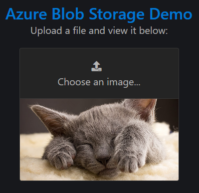

# Azure Blob Storage Demo

Demonstrates using [Microsoft.Azure.Storage.Blob](https://www.nuget.org/packages/Microsoft.Azure.Storage.Blob/) to store and retrieve files to/from [Azure Blob Storage](https://docs.microsoft.com/en-us/azure/storage/blobs/storage-blobs-introduction).

## Usage

Install the [Azure Storage Emulator](https://docs.microsoft.com/en-us/azure/storage/common/storage-use-emulator), or update the connection string to refer to a storage account to which you have access. Then:

### Run the console app

This application uploads and then immediately downloads and displays an image (included in the project):

```cmd
> cd .\AzureBlobStorageDemo.ConsoleApp\
> dotnet run
```

```plain
Azure Blob Storage demo
=======================
Using connection string: UseDevelopmentStorage=true
Creating container "photos" if it doesn't already exist...

Uploading "blob.png" to container "photos"...
Uploaded: http://127.0.0.1:10000/devstoreaccount1/photos/blob.png

Downloading "blob.png" as "download.png"...
Downloaded: download.png
```

(The downloaded image should automatically open in your system's default image viewer.)

### Run the web app

This application demonstrates uploading images via an <span>ASP.NET</span> MVC controller using `<input type="file">`:

```cmd
> cd .\AzureBlobStorageDemo.WebApp\
> dotnet run
```

Wait for the app to start up then open it in your web browser (defaults to <http://localhost:5000>):



## Tools

* <https://azure.microsoft.com/en-us/features/storage-explorer/>
* <https://docs.microsoft.com/en-us/azure/storage/common/storage-use-emulator>

## Resources

* <https://app.pluralsight.com/library/courses/microsoft-azure-blob-storage-implementing/table-of-contents>
